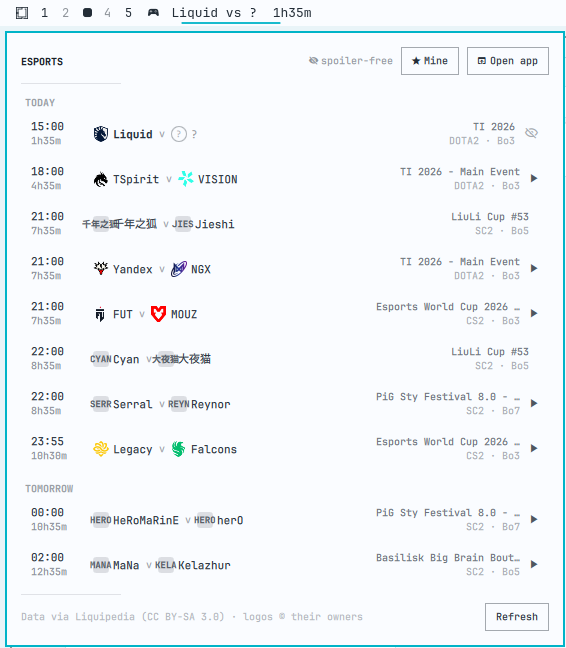

# Esports



A spoiler-free match schedule on the Omarchy bar. The next match for a team
you follow sits on the chip with a countdown; click it for what is live, what
is coming, and what you still have to watch.

- **Next match on the bar** with a live countdown.
- **Click a match** for streams, the VOD, and Liquipedia pages.
- **Spoiler-free by construction.** A result you have not revealed is absent
  from the file this widget reads, not merely undrawn.
- **Catch-up masking.** If you are behind on a team, later opponents are
  withheld too — knowing who they play next tells you they won.
- **★ Mine** filters the list to your teams.
- **Dota 2**, **Counter-Strike** and **StarCraft II** out of the box; 37 games
  verified and one toggle away.

This plugin is the front end. It never talks to the network. The
`omarchy-esports` daemon fetches, redacts, and notifies.

## Requires the daemon

Until the daemon is running the widget shows a panel that names the repo.

```sh
git clone https://github.com/matt-shearing/omarchy-esports.git
cd omarchy-esports && ./install.sh
```

That builds the daemon (Go is required), the companion app, and a user-session
service. If this plugin is already a git checkout, `install.sh` leaves it
alone. No sudo or pkexec is required.

## Install

```sh
omarchy plugin add https://github.com/matt-shearing/omarchy-esports-plugin.git --enable
```

That clones the plugin and can place the widget on the left side of the bar.

Or by hand:

```sh
git clone https://github.com/matt-shearing/omarchy-esports-plugin.git \
  ~/.config/omarchy/plugins/contra.esports
omarchy-shell shell rescanPlugins
omarchy plugin enable contra.esports --section left
```

Nothing in `~/.config` is rewritten except the bar layout entry Omarchy adds
when you enable the plugin.

## Remove

```sh
omarchy plugin remove contra.esports
```

That leaves the daemon and its state. To uninstall those too, see
[omarchy-esports](https://github.com/matt-shearing/omarchy-esports).

## Requirements

- Omarchy Quattro with third-party shell plugins
- The `omarchy-esports` daemon from the companion repo above
- `go` to build the daemon

## Settings

Widget options live on the bar entry in `~/.config/omarchy/shell.json`:

```sh
omarchy bar set contra.esports showLabel false   # icon only
omarchy bar set contra.esports maxRows 14        # rows in the dropdown
omarchy bar set contra.esports showFinished false
omarchy bar set contra.esports hideWhenEmpty true
```

## Keybinding

```lua
-- ~/.config/hypr/bindings.lua
o.bind("SUPER + ALT + E", "Esports panel", "omarchy-shell shell toggle contra.esports")
```

Bind through `shell toggle` rather than a plugin IPC target: a bar widget is
instantiated once per monitor and an IPC target reaches only one of them, so an
IPC binding opens the panel on the wrong screen. `shell toggle` routes through
the bar, which picks the focused one.

## Development

```sh
omarchy plugin validate .
```

Edits under `~/.config/omarchy/plugins/contra.esports/` reload in the running
shell. Force a rescan with `omarchy-shell shell rescanPlugins` if a change does
not appear.

## Licence

MIT. Match data from [Liquipedia](https://liquipedia.net), CC BY-SA 3.0. See
[LICENSE](LICENSE).
